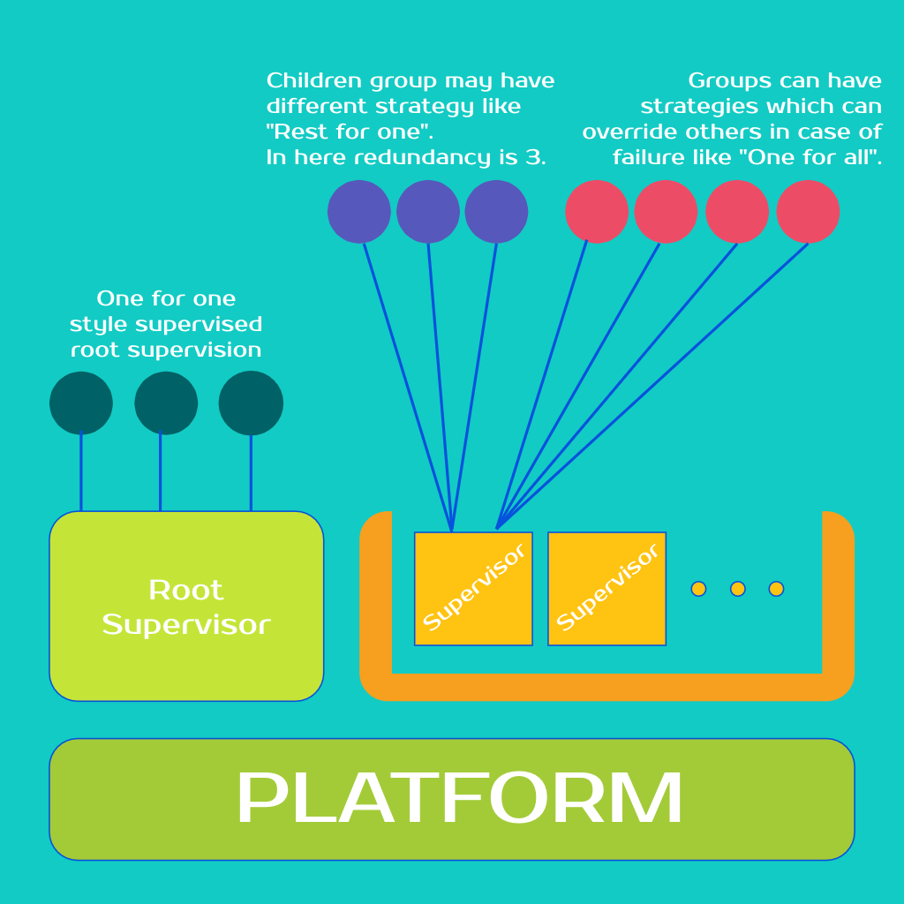

<div align="center">
  <br>
</div>

-----------------

<h1 align="center">Bastion: Fault-tolerant Runtime for Rust applications</h1>

*The breeze of the cold winter had come. This time of the year, Crashers arrive in the village. These are the giants who can't be evaded. They born to destroy and take people to the Paniks Heights. Suddenly, The developer descried the blurry silhouettes of Crashers from afar.*

*With cold and cracked voice, he whispered:*

*It is time to go to **Bastion Fort**.*

---

<table align=left style='float: left; margin: 4px 10px 0px 0px; border: 1px solid #000000;'>
<tr>
  <td>Latest Release</td>
  <td>
    <a href="https://crates.io/crates/bastion">
    
    </a>
  </td>
</tr>
<tr>
  <td></td>
</tr>
<tr>
  <td>License</td>
  <td>
    <a href="https://github.com/vertexclique/bastion/blob/master/LICENSE">
    
    </a>
</td>
</tr>
<tr>
  <td>Build Status</td>
  <td>
    <a href="https://travis-ci.org/vertexclique/bastion">
    
    </a>
  </td>
</tr>
<tr>
  <td>Downloads</td>
  <td>
    <a href="https://crates.io/crates/bastion">
    
    </a>
  </td>
</tr>
<tr>
	<td>Gitter</td>
	<td>
		<a href="https://gitter.im/bastionframework/community">
		
		</a>
	</td>
</tr>
<tr>
	<td>Caffeine</td>
	<td>
	    <a href="https://liberapay.com/vertexclique/donate">
	    
	    </a>
	</td>
</tr>
</table>

---

Bastion is a Fault-tolerant Runtime for Rust applications.
It detect panics during runs of your code and serves a runtime to
prevent abrupt exits. Also, it enables you to continue serving in case of
a failure. You can select your own recovery scenario, scale your workers and
define whole application on top of it. 

---

## Usage

Bastion comes with a default one-for-one strategy root supervisor.
You can use this to launch automatically supervised tasks.

Check [root supervisor](https://github.com/vertexclique/bastion/blob/master/examples/root_spv.rs) example in examples.

[Examples](https://github.com/vertexclique/bastion/blob/master/examples) cover all the use cases in the frame of the crate.

Include bastion to your project with, it requires nightly features to do it's job:
```toml
bastion = "*"
```

In most simple way you can use Bastion like here:
```rust
use bastion::prelude::*;

fn main() {
    Bastion::platform();

    // Define, calculate or prepare messages to be sent to the processes. 
    let message = String::from("Some message to be passed");

    Bastion::spawn(
        |context, msg: Box<dyn Message>| {
            // Message can be selected with receiver here. Take action!
            receive! { msg,
                String => |e| { println!("Received string :: {}", e)},
                i32 => |e| {println!("Received i32 :: {}", e)},
                _ => println!("No message as expected. Default")
            }

            // Do some processing in body
            println!("root supervisor - spawn_at_root - 1");

            // Rebind to the system
            context.hook();
        },
        message,
    );

    Bastion::start()
}
```

## Structure of the Runtime

Runtime is structured by the user. Only root supervision comes in batteries-included fashion.
Worker code, worker group redundancy, supervisors and their supervision strategies are defined by the user.

You can see overall architecture of the framework here:
 


## License

License is [MIT](https://github.com/vertexclique/bastion/blob/master/LICENSE)

## Documentation

Official documentation is hosted on [docs.rs](https://docs.rs/bastion).

## Getting Help
Please head to our [Gitter](https://gitter.im/bastionframework/community) or use [StackOverflow](https://stackoverflow.com/questions/tagged/bastionframework)

## Discussion and Development
We use [Gitter](https://gitter.im/bastionframework/community) for development discussions. Also please don't hesitate to open issues on GitHub ask for features, report bugs, comment on design and more!
More interaction and more ideas are better!

## Contributing to Bastion [](https://www.codetriage.com/vertexclique/bastion)

All contributions, bug reports, bug fixes, documentation improvements, enhancements and ideas are welcome.

A detailed overview on how to contribute can be found in the  [CONTRIBUTING guide](.github/CONTRIBUTING.md) on GitHub.

### Thanks

Thanks to my dear mom (Günnur Bulut) who is an artist with many things to do but
spending her efforts without any hesitation on small things that I requested
(Like this logo). My shining star.

Also, thanks to my friend [Berkan Yavri](http://github.com/yavrib) who helped to the idea of making this.
Debated over the approaches that I took, spent time on thinking about this project with me.
