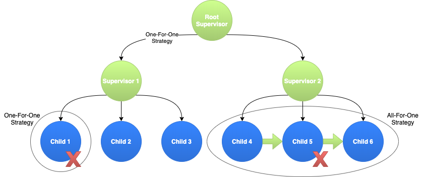

<div align="center">
  <br>
</div>

---

<table>
  <tr>
    <td>Latest Release</td>
    <td>
      <a href="https://crates.io/crates/bastion">
      
      </a>
    </td>
    <td>License</td>
    <td>
      <a href="https://github.com/bastion-rs/bastion/blob/master/LICENSE">
      
      </a>
    </td>
  </tr>
  <tr>
    <td>Doc [Bastion]</td>
    <td>
      <a href="https://docs.rs/bastion">
      
      </a>
    </td>
    <td>Downloads</td>
    <td>
      <a href="https://crates.io/crates/bastion">
      
      </a>
    </td>
  </tr>
  <tr>
  <td>Doc [Bastion Executor]</td>
    <td>
      <a href="https://docs.rs/bastion-executor">
      
      </a>
    </td>
    <td>Discord</td>
    <td>
      <a href="https://discord.gg/DqRqtRT">
      
      </a>
    </td>
  </tr>
  <tr>
  </tr>
  <tr>
    <td>Doc [LightProc]</td>
    <td>
      <a href="https://docs.rs/lightproc">
      
      </a>
    </td>
    <td>Build Status</td>
    <td>
      <a href="https://github.com/bastion-rs/bastion/actions">
      
      </a>
    </td>
  </tr>
</table>

---

<h1 align="center">Highly-available Distributed Fault-tolerant Runtime</h1>

Bastion is a highly-available, fault-tolerant runtime system with dynamic, dispatch-oriented, lightweight process model. It supplies actor-model-like concurrency with a lightweight process implementation and utilizes all of the system resources efficiently guaranteeing of at-most-once message delivery.

---

## Usage

Bastion comes with a default one-for-one strategy root supervisor.
You can use this to launch automatically supervised tasks.

## Get Started

Include bastion to your project with:
```toml
bastion = "0.4"
```

### Documentation

Official documentation is hosted on [docs.rs](https://docs.rs/bastion).

### Examples

Check the [getting started example](https://github.com/bastion-rs/bastion/blob/master/src/bastion/examples/getting_started.rs) in <code>bastion/examples</code>

[Examples](https://github.com/bastion-rs/bastion/blob/master/src/bastion/examples) cover possible use cases of the crate.

## Features
* Message-based communication makes this project a lean mesh of actor system.
    * Without web servers, weird shenanigans, forced trait implementations, and static dispatch.
* Runtime fault-tolerance makes it a good candidate for distributed systems.
    * If you want the smell of Erlang and the powerful aspects of Rust. That's it!
* Completely asynchronous runtime with NUMA-aware and cache-affine SMP executor.
    * Exploiting hardware locality wherever it is possible. It is designed for servers.
* Supervision system makes it easy to manage lifecycles.
    * Kill your application in certain condition or restart you subprocesses whenever a certain condition is met.
* Automatic member discovery, cluster formation and custom message passing between cluster members.
    * Using zeroconf or not, launch your bastion cluster from everywhere, with a single actor block.
* Proactive IO system which doesn't depend on anything other than `futures`.
    * Bastion's proactive IO has scatter/gather operations, `io_uring` support and much more...

## Guarantees
* At most once delivery for all messages.
* Completely asynchronous system design.
* Asynchronous program boundaries with [fort](https://github.com/bastion-rs/fort).
* Dynamic supervision of supervisors (adding a subtree later during the execution)
* Lifecycle management both at `futures` and [lightproc](https://github.com/bastion-rs/bastion/tree/master/src/lightproc) layers.
* Faster middleware development.
* Fault tolerance above all.

## Why Bastion?
If you answer any of the questions below with yes, then Bastion is just for you:
* Do I want proactive IO?
* Do I need fault-tolerance in my project?
* Do I hate to implement weird Actor traits?
* I shouldn't need a webserver to run an actor system, right?
* Do I want to make my existing code unbreakable?
* Do I have some trust issues with orchestration systems?
* Do I want to implement my own application lifecycle?

## Bastion Ecosystem

Bastion Ecosystem is here to provide you a way to customize it. If you don't need to, or if you are a newcomers, you can install and use Bastion without knowing how everything works under the hood. We hope to find you on this section soon.

### [Nuclei](https://github.com/vertexclique/nuclei)
Nuclei is proactive IO system that can be independently used without executor restriction. It is also powering Bastion's IO system.
You can learn more about Nuclei [here](https://github.com/vertexclique/nuclei), check out Nuclei's repo for more sophisticated use cases.

### [LightProc](https://github.com/bastion-rs/bastion/tree/master/src/lightproc)

LightProc is Lightweight Process abstraction for Rust.

It uses futures with lifecycle callbacks to implement Erlang like processes and contains basic pid to identify processes.
All panics inside futures are propagated to upper layers.

### [Bastion Executor](https://github.com/bastion-rs/bastion/tree/master/src/bastion-executor)

Bastion Executor is NUMA-aware SMP based Fault-tolerant Executor, highly-available and async communication oriented.

It's independent of it's framework implementation. It uses lightproc to encapsulate and provide fault-tolerance to your future based workloads. You can use your futures with lightproc to run your workloads on Bastion Executor without the need to have framework.

### [Agnostik](https://github.com/bastion-rs/agnostik)
Agnostik is a layer between your application and the executor for your async stuff. It lets you switch the executors smooth and easy without having to change your applications code. Valid features are `runtime_bastion` (default), `runtime_tokio`, `runtime_asyncstd` and `runtime_nostd` (coming soon).

## Architecture of the Runtime
Runtime is structured by the user. Only root supervision comes in batteries-included fashion.
Worker code, worker group redundancy, supervisors and their supervision strategies are defined by the user.

Supervision strategies define how child actor failures are handled, how often a child can fail, and how long to wait before a child actor is recreated. As the name suggests, One-For-One strategy means the supervision strategy is applied only to the failed child. All-For-One strategy means that the supervision strategy is applied to all the actor siblings as well. One-for-one supervision is used at the root supervisor, while child groups may have different strategies like rest-for-one or one-for-all.



## Community
### Getting Help
Please head to our [Discord](https://discord.gg/DqRqtRT) or use [StackOverflow](https://stackoverflow.com/questions/tagged/bastion)

### Discussion and Development
We use [Discord](https://discord.gg/DqRqtRT) for development discussions. Also please don't hesitate to open issues on GitHub ask for features, report bugs, comment on design and more!
More interaction and more ideas are better!

### Contributing to Bastion [](https://www.codetriage.com/bastion-rs/bastion)

All contributions, bug reports, bug fixes, documentation improvements, enhancements and ideas are welcome.

A detailed overview on how to contribute can be found in the  [CONTRIBUTING guide](https://github.com/bastion-rs/.github/blob/master/CONTRIBUTING.md) on GitHub[.](https://youtu.be/w55YCDzZjvA)

## License

Licensed under either of

 * Apache License, Version 2.0 ([LICENSE-APACHE](LICENSE-APACHE) or http://www.apache.org/licenses/LICENSE-2.0)
 * MIT license ([LICENSE-MIT](LICENSE-MIT) or http://opensource.org/licenses/MIT)

at your option.

[](https://app.fossa.io/projects/git%2Bgithub.com%2Fbastion-rs%2Fbastion?ref=badge_large)

[](https://app.fossa.io/projects/git%2Bgithub.com%2Fbastion-rs%2Fbastion?ref=badge_shield)
